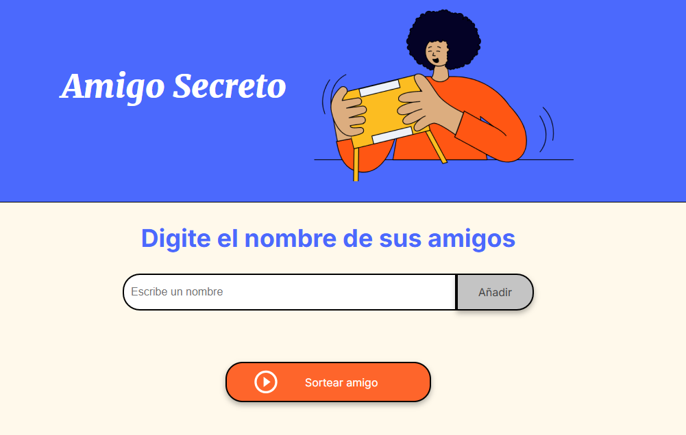
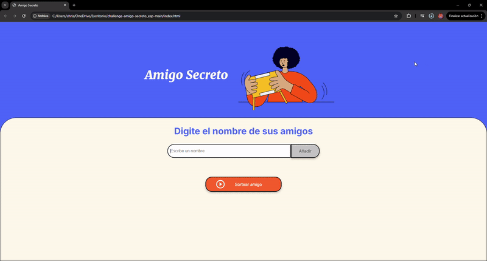
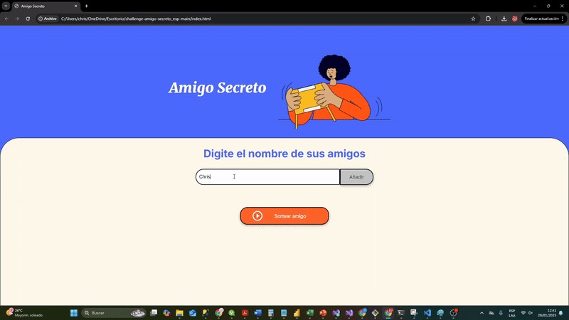

# 🎉 Amigo Secreto [](https://opensource.org/licenses/MIT)

## 📌 Descripción

Este proyecto es una aplicación web simple que permite a los usuarios ingresar nombres de amigos y realizar un sorteo aleatorio para determinar quién será el "Amigo Secreto".

## ✨ Funcionalidades

✅ Agregar nombres a la lista.  
✅ Validar la entrada para evitar nombres vacíos o duplicados.  
✅ Visualizar los nombres ingresados en una lista.  
✅ Sortear un "Amigo Secreto" aleatoriamente.  
✅ Mostrar el resultado del sorteo en pantalla.  

## 📷 Capturas de pantalla

### 1️⃣ **Interfaz inicial**

> Se muestra un campo de entrada y un botón para agregar nombres.



### 2️⃣ **Nombres agregados**

> Los nombres ingresados aparecen en la lista de la interfaz.



### 3️⃣ **Sorteo realizado**

> Al hacer clic en "Sortear amigo", se elige un nombre aleatorio y se muestra el resultado.



## 🚀 Instalación y ejecución

### 1️⃣ Clonar el repositorio

```bash
git clone https://github.com/AdminPublicTest/challenge-amigo-secreto_esp-main.git
```

### 2️⃣ Instalar dependencias (si aplicable)

```bash
cd amigo-secreto
npm install  # Solo si hay dependencias
```

### 3️⃣ Abrir el archivo HTML

```bash
start index.html # Para Windows
open index.html # Para Mac
xdg-open index.html # Para Linux
```

## 🛠️ Tecnologías utilizadas

- HTML5
- CSS3
- JavaScript (Vanilla JS)

## 📌 Cómo usarlo

```javascript
// Agregar un amigo a la lista
function agregarAmigo() {
    let inputAmigo = document.getElementById("amigo");
    let nombre = inputAmigo.value.trim();

    if (nombre === "") {
        alert("Por favor, inserte un nombre.");
        return;
    }

    if (amigos.includes(nombre)) {
        alert("Este nombre ya ha sido ingresado.");
        return;
    }

    amigos.push(nombre);
    actualizarLista();
    inputAmigo.value = "";
}

// Sorteo aleatorio
function sortearAmigo() {
    let resultadoElement = document.getElementById("resultado");

    if (amigos.length === 0) {
        alert("Debe agregar al menos un nombre para sortear.");
        return;
    }

    let indiceAleatorio = Math.floor(Math.random() * amigos.length);
    let amigoSecreto = amigos[indiceAleatorio];

    resultadoElement.innerHTML = `<li>🎉 El amigo secreto es: <strong>${amigoSecreto}</strong> 🎉</li>`;
}
```

## 📖 Documentación

Consulta nuestra [Guía de Uso](https://github.com/tu-usuario/amigo-secreto/wiki) para más información sobre cómo personalizar y mejorar la aplicación.

## 🔍 Compatibilidad
Este proyecto ha sido probado en los siguientes navegadores:
- ✅ Google Chrome
- ✅ Mozilla Firefox
- ✅ Microsoft Edge
- ✅ Safari

## ✅ Pruebas
Para ejecutar pruebas unitarias (si aplicable), usa:
```bash
npm test
```

## 🔥 Mejoras futuras

- Agregar la opción de eliminar nombres de la lista.
- Permitir exportar la lista en formato CSV o PDF.
- Implementar un temporizador para el sorteo.
- Mejorar la interfaz con animaciones CSS.

## 📜 Licencia

Este proyecto está bajo la licencia **MIT**.

---

🎯 **¡Espero que este README ayude a documentar y mejorar tu proyecto!** 🚀

